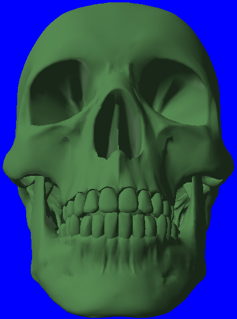
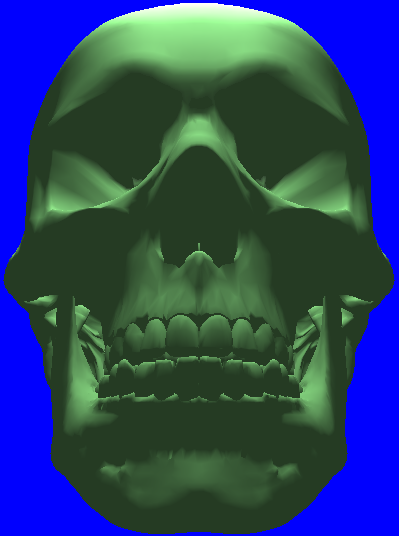
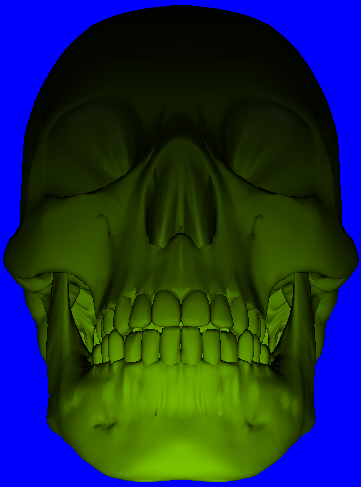
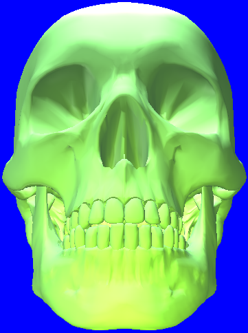
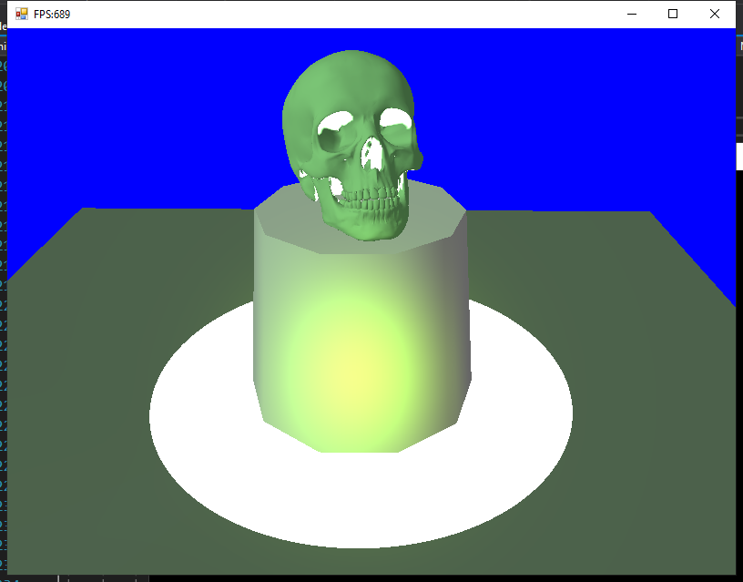

# 第七章 光照
## 7.1 光和材质作用
材质经过光照，用方程计算出结果，赋给颜色。
### 7.2.1 计算平面法线向量
取平面上不在同一直线上的三点，根据三点计算出两个向量，向量叉乘获得法线向量。
```csharp
public Vector3 ComputeNormal(Vector3 v1, Vector3 v2, Vector3 v3) {
    Vector3 temp;
    Vector3 u = v2 - v1;
    Vector3 v = v3 - v1;
    temp = Vector3.Cross(u, v);
    temp = Vector3.Normalize(temp);
    return temp;
}
```
平面上任一顶点的法线向量是由共享这个点的面法线向量计算得到的。这个平均的过程可以根据面积及逆行加权。

实现思路：
1. 对每个三角形片元分析，根据*三个顶点*的坐标位置计算出该片元的法向矢量
2. 将法向矢量赋值给三个顶点
3. 对有片元进行处理完毕后，每个顶点的Normal值是所有*与之相邻的片元法向矢量的和*
4. 最后遍历每个顶点，对Norma值归一化即可
## 7.4 漫反射
描述入射光：用`Vector3`三维向量即可，三个分量分别表示`RGB`三个颜色强度。

描述材料的反照率：用`Vector3`，分别描述材料对`RGB`三原色反照的比例。

此外，还应考虑朗伯余弦定律。*入射光向量和法向量*相乘作为一个乘数因子。

按照下述方式声明材料光照：
```csharp
struct Material {
    Vector4 Ambient;
    Vector4 Diffuse;
    Vector4 Specular;
    Vector4 Reflect;

    public Material(Vector4 ambient, Vector4 diffuse, Vector4 specular, Vector4 reflect) {
        Ambient = ambient;
        Diffuse = diffuse;
        Specular = specular;
        Reflect = reflect;
    }
}
```

## 7.12 光照实现
### 7.12.1 光的实现
在代码中声明三种光：平行光、点光源、聚光灯。

- 平行光：
```csharp
struct DirectionalLight {
    Vector4 Ambient;
    Vector4 Diffuse;
    Vector4 Specular;
    Vector3 Direction;
    float Pad;
    public DirectionalLight(Vector4 ambient, Vector4 diffuse, Vector4 specular, Vector3 direction, float pad) {
        Ambient = ambient;
        Diffuse = diffuse;
        Specular = specular;
        Direction = direction;
        Pad = pad;
    }
}
```
- 点光源：
```csharp
struct PointLight {
    Vector4 Ambient;
    Vector4 Diffuse;
    Vector4 Specular;
    // 包装成4D向量
    Vector3 Position;
    float Range;
    // 包装成4D向量
    Vector3 Att;
    float Pad;

    public PointLight(Vector4 ambient, Vector4 diffuse, Vector4 specular, Vector3 position, float range, Vector3 att, float pad) {
        Ambient = ambient;
        Diffuse = diffuse;
        Specular = specular;
        Position = position;
        Range = range;
        Att = att;
        Pad = pad;
    }
}
```
- 聚光灯:
```csharp
struct SpotLight {
    Vector4 Ambient;
    Vector4 Diffuse;
    Vector4 Specular;
    // 包装成4D向量
    Vector3 Position;
    float Range;
    // 包装成4D向量
    Vector3 Direction;
    float Spot;
    // 包装成4D向量
    Vector3 Att;
    float Pad;
}
```

此外在fx文件中也要交代一下。

```cpp
struct DirectionalLight
{
	float4 Ambient;
	float4 Diffuse;
	float4 Specular;
	float4 Direction;
	float Pad;
};

struct PointLight
{
	float4 Ambient;
	float4 Diffuse;
	float4 Specular;

	float3 Position;
	float Range;

	float3 Attr;
	float Pad;
};

struct SpotLight
{
	float4 Ambient;
	float4 Diffuse;
	float4 Specular;

	float4 Position;
	float Range;

	float4 Direction;
	float Spot;

	float4 Att;
	float Pad;
};
```

Effect编译期间踩的坑：
- 未知函数名称—>将函数放在调用前面
- 未知结构体名称—>放在前面
- 总之就是未知的东西，放在调用前面就对了。。。

## 重要：对自定义的结构体，如何将数据从C#传递给.fx中的变量
设置光照时，磕了两天的bug。。。最后在
参考代码：[noire_history](https://github.com/hozuki/noire_history/blob/master/Noire.Graphics.D3D11/FX/BasicEffect11.cs)中学习到了。

- 通过`Effect.GetVariableByName()`获得`EffectVariable`类型变量。
- 调用`EffectVariable`的`SetRawValue()`方法进行设置。
  - 该方法第一个参数是`SharpDX.DataStream`类的实例：由其静态方法`Create()`创建
  - `Create()`第一个参数是`byte[]`结构体，该结构体通过`System.Copy()`方法获得数据
  - 第二个参数是字节长度

C#程序中的结构体数据通过自定义的`Tools.StructureToBytes()`方法转化为`byte[]`。

程序中将一个**自定义的平行光结构体**传入`fx`中常量的方法：
```csharp
DirectionalLight mDirLight = new DirectionalLight();;
private byte[] _dirLightsArray = new byte[Marshal.SizeOf(typeof(DirectionalLight)) * 1];

mDirLight.Ambient   = new Vector4(0.2f, 0.2f, 0.2f, 1.0f);
mDirLight.Diffuse   = new Vector4(0.5f, 0.5f, 0.5f, 1.0f);
mDirLight.Specular  = new Vector4(0.5f, 0.5f, 0.5f, 1.0f);
mDirLight.Direction = new Vector3(0.57735f, -0.57735f, 0.57735f);
// 下面这一段代码每帧都需要调用
var d = Tools.StructureToBytes(mDirLight);
Array.Copy(d, 0, _dirLightsArray, 0, Marshal.SizeOf(typeof(DirectionalLight)));
using (var dataStream = DataStream.Create(_dirLightsArray, false, false)) {
    mfxDirLight.SetRawValue(dataStream, _dirLightsArray.Length);
}
// 辅助函数
public static byte[] StructureToBytes<T>(T obj) where T : struct {
    var len = Marshal.SizeOf(obj);
    var buf = new byte[len];
    var ptr = Marshal.AllocHGlobal(len);
    Marshal.StructureToPtr(obj, ptr, true);
    Marshal.Copy(ptr, buf, 0, len);
    Marshal.FreeHGlobal(ptr);
    return buf;
}

```

**自定义的结构体可以像上述方法传递数据，但内嵌的结构体如`Matrix`,`float4x4`失败，应该在effect中调用`AsXXX()`方法进行传值。**

如图分别是单光源(平行光、点光源、聚焦灯)、组合光源的光照效果。









定义数组保存模型及其相关数据。做一个简单的demo：


