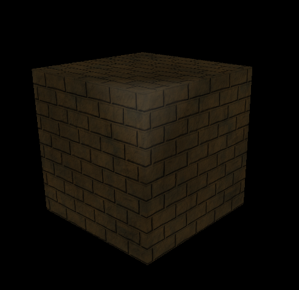
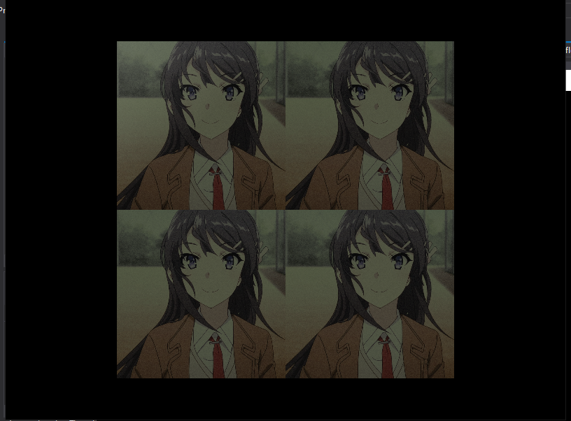
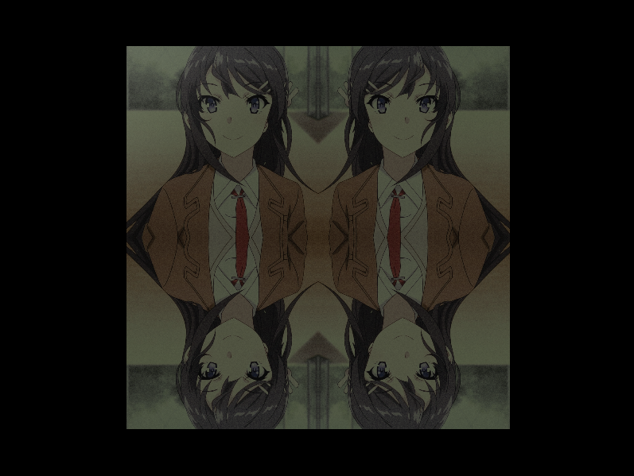
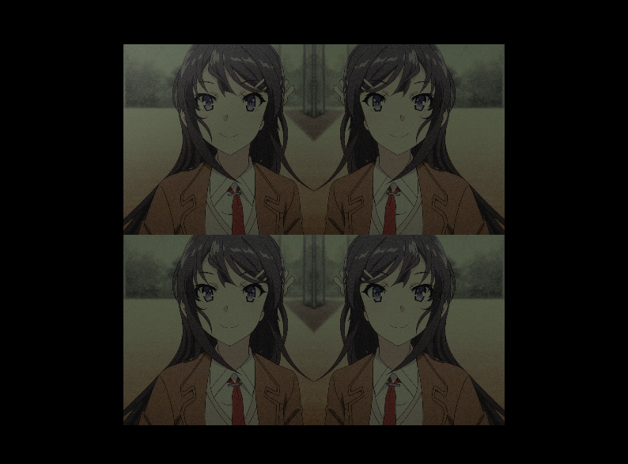
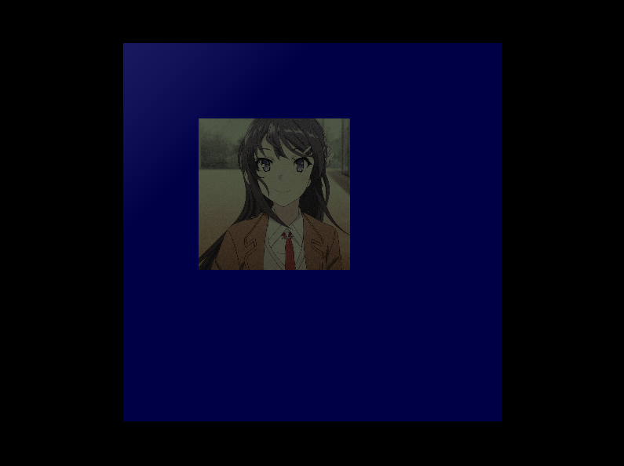
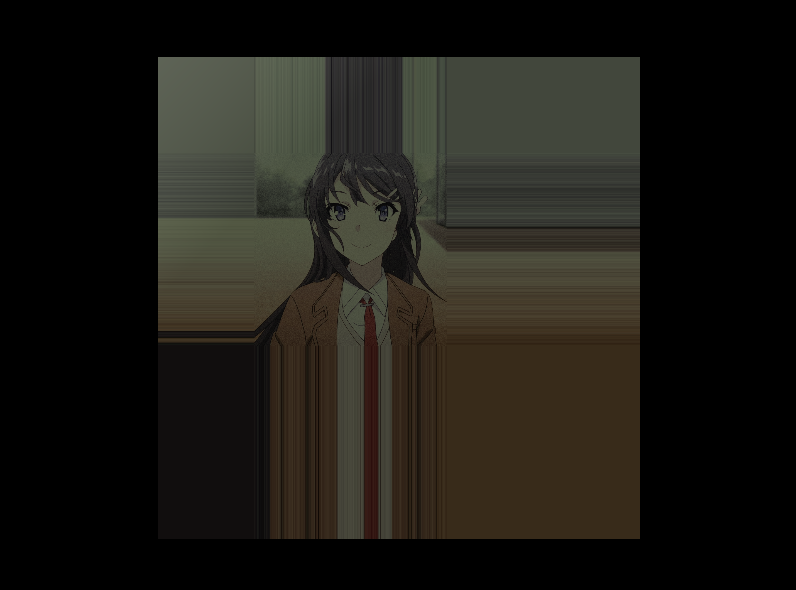
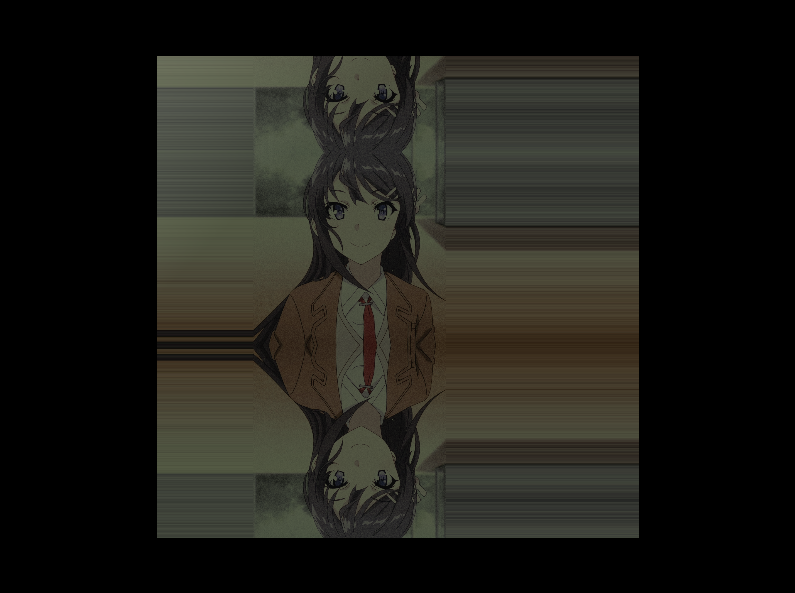

# 8 纹理
## 8.3 使用贴图
纹理数据通常从磁盘上的图像文件读取得来。将纹理保存为`ID3D11Texture2D`对象。为它创建`ID3D11ShaderResourceView`，然后绑定在管线上。因此需要以下两步：
- 调用`D3DX11CreateTextureFromFile()`创建`ID3D11Texture2D`对象
- 调用`ID3D11Device::CreateShaderResourceView()`创建对应的`Shader Resource View`对象。

以上两步整合到`D3DX11CreateShaderResourceViewFromFile()`中。
```cpp
HRESULT D3DX11CreateShaderResourceViewFromFile(
	ID3D11Device *pDevice,
	LPCTSTR pSrcFile,
	D3DX11_IMAGE_LOAD_INFO *pLoadInfo,
	ID3DX11ThreadPump *pPump,
	ID3D11ShaderResourceView **ppShaderResourceView,
	HRESULT *pHResult
);
```
各参数含义：
1. **pDevice**: Pointer to the D3D device to create the texture with.
2. **pSrcFile**: Filename of the image to load.
3. **pLoadInfo**: Optional image info; specify ***null*** to use the information from the source image. For example, if we specify null here, then the source image dimensions will be used as the texture dimensions; also ***a full mipmap chain*** will be generated. This is usually what we always want and a good default choice.
4. **pPump**: Used to spawn ***a new thread for loading the resource***. To load the resource in the main thread, specify ***null***. In this book, we will always specify null.
5. **ppShaderResourceView**: Returns a pointer to the created shader resource view to the texture loaded from file.
6. **pHResult**: Specify ***null*** if null was specified for pPump.

该函数可以加载如下的图像格式(定义在**D3DX11_IMAGE_FILE_FORMAT**中)：
- BMP
- JPG
- PNG
- DDS
- TIFF
- GIF
- WMP

一旦纹理加载到程序中，我们需要将它传递给*effect*文件中定义的变量。在*fx*文件中，纹理格式是`Texture2D`。注意，非数字类值不可添加到`cbuffer`中。在fx文件的常量缓冲区外中定义如下：
```c
Texture2D gDiffuseMap;
```
程序中通过
```cpp
ID3DX11EffectShaderResourceVariable* fxDiffuseMap;
fxDiffuseMap = mFX->GetVariableByName("gDiffuseMap")->AsShaderResource();
```
获得指针。

通过下述来更新着色器中的内容
```cpp
fxDiffuseMap->SetResource(mDiffuseMapSRV);
```

更新完内容后应用`pass`即可。

## 8.5 纹理采样
在`.fx`文件中，除了`Texture2D`表示贴图。还有`SamplerState`，它是用来定义过滤器的。即对`minification,magnification,mipmapping`进行设置。
```cpp
SamplerState mySampler
{
	Filter = ANISOTROPIC;
	MaxAnisotropy = 4;
};
```

使用示例：
```cpp
Texture2D gDiffuseMap;
SamplerState samAnisotropic
{
	Filter = ANISOTROPIC;
	MaxAnisotropy = 4;
};
struct VertexOut
{
	float4 PosH : SV_POSITION;
	float3 PosW : POSITION;
	float3 NormalW : NORMAL;
	float2 Tex : TEXCOORD;
};
float4 PS(VertexOut pin, uniform int gLightCount) : SV_Target
{
	// other code
	float4 texColor = gDiffuseMap.Sample(samAnisotropic, pin.Tex);
	// other code: 计算ambient,diffuse,spec三种光照颜色
	litColor = texColor*(ambient + diffuse) + spec;
	// other code
}
```

`texColor`就是经过采样、插值后得到的像素的纹理颜色。最后一行代码将纹理和材质计算出来的光照结合在一起，算得一个综合值。

## 在SharpDX中的实现
- C#程序中，利用SharpDX.WIC（需要安装SharpDX.Direct2D1包）读取图片数据，进行转换等等。具体进行下列过程：
  1. 从文件创建纹理(Texture2D)
  2. 从纹理创建资源视图(ShaderResourceView)
  3. 将上述步骤封装为一个函数(CreateShaderResourceViewFromFile)
  4. 初始化使用时，传入**设备对象和资源路径**，创建一个视图对象。
  5. 之后得到.fx着色器文件中的两个数据指针：`Texture2D gTexture`和`float4x4 gTexTransform`。后者是坐标变换矩阵，如果不需要特殊效果设置为单位阵——`Matrix.Identity`即可。
  6. 每帧都要设置`gTeture`和`gTexTransform`，然后`Apply()`

```csharp
public static SharpDX.Direct3D11.ShaderResourceView CreateShaderResourceViewFromFile(SharpDX.Direct3D11.Device device, string fileName) {
    Texture2D tempTex;  //声明纹理
    using (var bitmapSource = LoadBitmapSourceFromFile(_factory, fileName)) {
        // Allocate DataStream to receive the WIC image pixels
        int stride = bitmapSource.Size.Width * 4;
        using (var buffer = new SharpDX.DataStream(bitmapSource.Size.Height * stride, true, true)) {
            // Copy the content of the WIC to the buffer
            bitmapSource.CopyPixels(stride, buffer);
            tempTex = new SharpDX.Direct3D11.Texture2D(
                device,
                new SharpDX.Direct3D11.Texture2DDescription() {
                    Width = bitmapSource.Size.Width,
                    Height = bitmapSource.Size.Height,
                    ArraySize = 1,
                    BindFlags = SharpDX.Direct3D11.BindFlags.ShaderResource,
                    Usage = SharpDX.Direct3D11.ResourceUsage.Immutable,
                    CpuAccessFlags = SharpDX.Direct3D11.CpuAccessFlags.None,
                    Format = SharpDX.DXGI.Format.R8G8B8A8_UNorm,
                    MipLevels = 1,
                    OptionFlags = SharpDX.Direct3D11.ResourceOptionFlags.None,
                    SampleDescription = new SharpDX.DXGI.SampleDescription(1, 0),
                },
                new SharpDX.DataRectangle(buffer.DataPointer, stride));
            bitmapSource.Dispose();
        }
    }
    return new ShaderResourceView(device, tempTex);
}
public static SharpDX.WIC.BitmapSource LoadBitmapSourceFromFile(SharpDX.WIC.ImagingFactory factory, string filename) {
    using (var bitmapDecoder = new SharpDX.WIC.BitmapDecoder(factory, filename, SharpDX.WIC.DecodeOptions.CacheOnDemand)) {
        var result = new FormatConverter(factory);
        using (var bitmapFrameDecode = bitmapDecoder.GetFrame(0)) {
            result.Initialize(bitmapFrameDecode, PixelFormat.Format32bppPRGBA, BitmapDitherType.None, null, 0, BitmapPaletteType.Custom);
        }
        return result;
    }
}
```
- fx代码中：
  1. 声明一个纹理对象`Texture2D`和一个纹理采样状态`SamplerState`
  2. 在常量缓冲区`cbPerObject`中声明纹理坐标变换矩阵
  3. 在顶点着色器中，将2D纹理坐标扩展为四元数，接着与纹理坐标变换矩阵相乘，取x和y值
  4. 在像素着色器中，采样、计算像素点的纹理颜色(`texColor`)
  5. 将颜色与材质作用，计算出最终的颜色
```c
Texture2D gTexture;
SamplerState samAnisotropic
{
	Filter = ANISOTROPIC;
	MaxAnisotropy = 4;
	AddressU = WRAP;
	AddressV = WRAP;
};
//other code
float4 texColor = float4(1, 1, 1, 1);
texColor = gTexture.Sample(samAnisotropic, pin.Tex);	
float4 litColor = texColor * (ambient + diffuse) + spec;
```
结果：



## 8.8 纹理贴图方式(Address Modes)

纹理映射，结合常量/线性插值，其实就是一个函数映射关系：纹理坐标(u,b)-->(r,g,b,a)。D3D可以让我们以四种方式扩展：wrap, border color, clamp, mirror.
- wrap:重复(默认)
- border color:将[0,1]之外的纹理坐标映射为一个颜色
- clamp:将[0,1]之外的颜色映射为某点的颜色，该点为[0,1]^2范围内的与所求点距离最小的那个点。
- mirror:镜像

### Wrap
设置纹理坐标在[0,0]->[2,2]。

fx文件:
```cpp
SamplerState samAnisotropic
{
	Filter = ANISOTROPIC;
	MaxAnisotropy = 4;
	AddressU = WRAP;
	AddressV = WRAP;
};
```



设置纹理坐标在[0,0]->[2,2]。

fx文件:
```cpp
SamplerState samAnisotropic
{
	Filter = ANISOTROPIC;
	MaxAnisotropy = 4;
	AddressU = MIRROR;
	AddressV = MIRROR;
};
```



将其中的`AddressV`设置为`WRAP`：



设置SamplerState为Border，并重新设置纹理坐标为左上角[-0.5,-0.5]->右下角[2,2]：

```cpp
SamplerState samAnisotropic
{
	Filter = ANISOTROPIC;
	MaxAnisotropy = 4;
	AddressU = BORDER;
	AddressV = BORDER;
	BorderColor = float4(0, 0, 1, 1);
};
```


设置补全方式为Clamp



设置U向为Clamp，V向为Mirror：



(P.S.) 可以对不同方向设置独立的不同的补全方式。